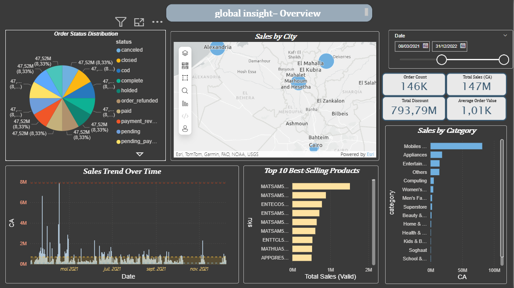
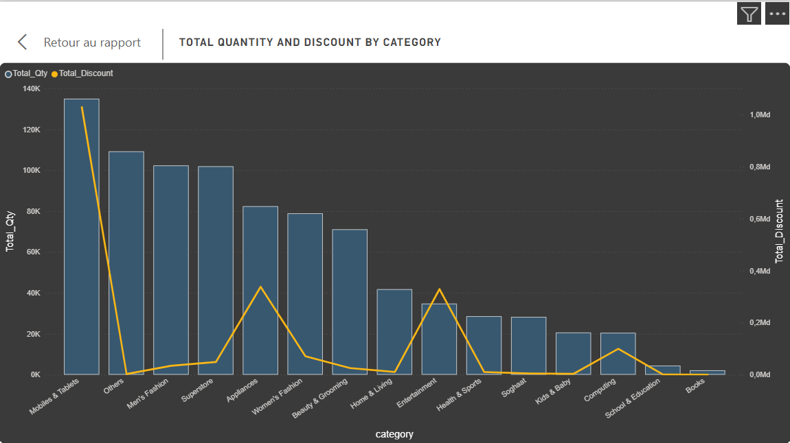
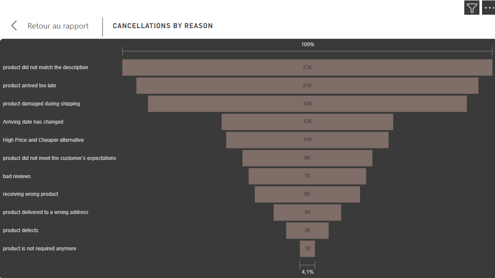

# Carrefour Sales Analysis | Power BI Business Intelligence Project

## Overview

This project presents an end-to-end **Business Intelligence workflow** built around Carrefour sales data, using **Python**, **Pandas**, and **Power BI**.

It covers the full analytics lifecycle: raw data ingestion, ETL processing, structured analytical preparation, data modeling with a **star schema**, KPI creation with **DAX**, and interactive dashboard reporting.

The goal is to transform raw transactional data into clear, decision-ready business insights through a clean and scalable BI approach.

---

## Business Objective

The objective of this project is to analyze Carrefour sales performance and provide an interactive reporting solution that supports business understanding and decision-making.

This project focuses on:

* measuring overall sales performance
* identifying high-performing products and categories
* tracking sales trends over time
* analyzing discount impact on revenue
* structuring data for efficient reporting and dashboard exploration

---

## End-to-End BI Workflow

**Raw Data → ETL Processing → Analytical Dataset → Data Model → Power BI Dashboard**

This project follows a structured Business Intelligence pipeline:

* **Raw Layer**: original transactional sales data
* **ETL Layer**: cleaning and transformation using Python
* **Processed Layer**: analysis-ready dataset
* **Semantic Layer**: Power BI data model built with a star schema
* **Reporting Layer**: interactive dashboard with KPIs and business visuals

This workflow reflects core BI and analytics engineering principles.

---

## Dataset

The dataset contains Carrefour sales transactions and business-related attributes such as:

* Order ID
* Order Date
* Order Status
* Item ID
* SKU
* Quantity Ordered
* Unit Price
* Sales Value
* Discount Percent
* Discount Amount
* Product Category
* Payment Method
* Year
* Month
* Customer Gender
* Customer Age
* City
* Cancellation / Refund Reason

### Dataset Scope

The project includes:

* a **raw dataset** used as the original source
* a **processed dataset** generated after ETL transformation
* a **sample version**  included in the repository for GitHub size limitations

---

## ETL Process

A lightweight ETL pipeline was developed using **Python Pandas** to prepare the dataset before reporting.

### Extract

The raw Carrefour sales data is loaded from a CSV source file.

### Transform

The transformation layer includes:

* reading the source file with the correct encoding
* cleaning and standardizing text values
* converting and formatting date columns
* standardizing month and year fields
* removing unnecessary columns
* fixing inconsistent values and formats
* preparing a structured dataset for analytics

### Load

The cleaned dataset is exported as a processed CSV file and used as the source for Power BI reporting.

### ETL Script

```bash
etl/etl.py
```

---

## Data Warehousing Approach

Although this project does not rely on a full enterprise warehouse platform, it follows a **warehouse-inspired layered architecture** aligned with common BI practices.

### Layered Structure

#### Raw Layer

Stores the original source data without transformation.

Example:

```bash
data/raw/Carrefour.csv
```

#### Processed Layer

Stores the cleaned analytical dataset produced by the ETL pipeline.

Example:

```bash
data/processed/final_dataset.csv
```

#### Reporting Layer

Stores the Power BI reporting file used for dashboard development.

Example:

```bash
dashboard/project_powerbi.pbit
```

### Why This Structure Matters

This layered organization improves:

* data quality and traceability
* separation between source and reporting logic
* reusability of the processed dataset
* reporting consistency
* maintainability of the BI workflow

It reflects a practical application of core **data warehousing principles** in a student BI project.

---

## Data Model | Star Schema

The Power BI model is designed using a **star schema** to support efficient reporting, clear relationships, and scalable analysis.

### Fact Table

The central fact table stores transactional business events:

* **FactSales**

This table contains measurable fields such as:

* quantity ordered
* sales value
* discount amount
* order-level transaction data

### Dimension Tables

The fact table is connected to descriptive dimensions such as:

* **DimDate**
* **DimProduct**
* **DimCustomer**
* **DimCity**
* **DimPayment**
* **DimCategory**

### Modeling Logic

Typical relationships include:

* `FactSales` → `DimDate`
* `FactSales` → `DimProduct`
* `FactSales` → `DimCustomer`
* `FactSales` → `DimCity`
* `FactSales` → `DimPayment`
* `FactSales` → `DimCategory`

### Why Star Schema

Using a star schema provides several BI advantages:

* better analytical performance
* simpler filtering and slicing
* clearer model organization
* easier KPI calculation
* stronger dashboard scalability

This is a standard modeling approach in Business Intelligence and reporting environments.

---

## DAX Measures | Key KPIs

To transform the raw transactional data into business indicators, the dashboard includes several **DAX measures**.

### Core Measures

```DAX
Total Sales = SUM(FactSales[value])
```

```DAX
Total Orders = COUNT(FactSales[order_id])
```

```DAX
Total Quantity = SUM(FactSales[qty_ordered])
```

```DAX
Total Discount = SUM(FactSales[discount_amount])
```

```DAX
Average Order Value = AVERAGE(FactSales[value])
```

### Time-Based Example

```DAX
Monthly Sales = CALCULATE([Total Sales], ALLEXCEPT(DimDate, DimDate[Month]))
```

### KPI Value

These measures support:

* revenue monitoring
* order volume tracking
* sales trend analysis
* discount impact evaluation
* dashboard-level KPI cards and business summaries

They form the analytical core of the Power BI reporting layer.

---

## Dashboard Features

The Power BI dashboard was designed to provide a clear and interactive view of sales performance.

### Main Features

* KPI cards for business performance tracking
* product and category-level analysis
* time-based trend analysis
* interactive filters and slicers
* reporting visuals for quick decision support

### Example Questions Answered

* Which categories generate the highest sales?
* Which products perform best?
* How do sales evolve over time?
* What is the impact of discounts on sales value?
* Which customer segments are most active?

---

## Key Business Insights

This project supports the extraction of insights such as:

* top-performing categories
* best-selling products
* monthly and seasonal sales patterns
* discount behavior and its revenue effect
* customer and city-level sales trends

These insights can help improve pricing, inventory planning, and commercial performance analysis.

---

## Tools & Technologies

This project was developed using:

* **Python**
* **Pandas**
* **Power BI**
* **DAX**
* **CSV / Excel**
* **Git**
* **GitHub**

---

## Project Structure

```bash
carrefour-sales-powerbi/
│
├── data/
│   ├── raw/
│   │   └── Carrefour.csv
│   │
│   └── processed/
│       └── final_dataset.csv
│
├── etl/
│   └── etl.py
│
├── dashboard/
│   └── project_powerbi.pbit
│
├── screenshots/
│   ├── dashboard_overview.png
│   ├── sales_analysis.png
│   └── product_analysis.png
│
├── requirements.txt
└── README.md
```

---

## How to Run the ETL Script

Make sure Python and Pandas are installed.

### Install dependencies

```bash
pip install pandas
```

### Run the ETL script

```bash
python etl/etl.py
```

This generates the cleaned dataset used in the Power BI reporting layer.

---

## Power BI Usage

1. Open the Power BI file in **Power BI Desktop**
2. Connect or reconnect the processed dataset if required
3. Refresh the model
4. Explore the dashboard using the available visuals, filters, and slicers

---

## Dashboard Preview

Add screenshots here to provide a quick visual overview of the solution.

Example:

```markdown



```

---

## Repository Notes

Due to GitHub file size limitations:

* a reduced sample dataset may be included in this repository
* the full Power BI file may be excluded if it exceeds size limits
* full datasets can be shared externally

### Full Dataset Links

* **Raw full dataset:** https://drive.google.com/file/d/1X8w2iwG33Yd4KUv2MXWcPAy2ngNGf-DJ/view
* **Processed full dataset:** https://drive.google.com/file/d/1939kxoTLac0OPcrJ3B8phA9asYU4_G3M/view

---


## Author

**Malak Mounji**
